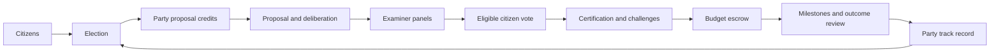

# Pilot findings — 2026-10-06

The first experiment completed six runs: seeds 7, 19 and 43, each in WEIGHTED and
FLAT mode, with 1,000 initial citizens and 100 initial leaders. Each run includes
two elections and nine project votes. The full six-run pilot took 26.2 seconds in
this workspace. That elapsed time is observational, not a consensus throughput result.

- 772 scenario assertions passed.
- 60,878 examination attempts produced 55,540 counted ballots across the sessions.
- 5,300 exam attempts failed the comprehension check.
- 8,382 issued tokens involved a dishonest/inaccurate reading claim and bond slash.
- 42,670 sampled-token audit operations ran, plus targeted cartel probes.
- Every run conserved all 100,000 simulated treasury units and ended without a
  dangling vote reservation.
- All 61,551 hash-chained event records reproduced byte for byte from their seeds.
- The local network committed the pilot manifest at height 11, and all seven
  validator RPCs returned matching document bytes, application hashes and block IDs.

## Does the society's intended loop work?

At reference-model level, yes: citizen admission and authority checks lead to party
qualification, elections allocate scarce agenda credits, credit spending opens a
proposal, examined and conflict-excluded citizens decide, final passing results
convert reserves into escrow, and milestone attestations govern release. Failed
projects return their unspent resources and penalize the proposing party; that
track record affects the next election.

The first election favored Builders in all seeds. In seeds 7 and 19, Researchers
became the leading party in the second election in both modes. In seed 43,
Builders retained the lead with comprehension weights and Researchers led with
flat weights. Frontier qualified but earned no credits in the first election;
Micro did not qualify. Losing candidates were not deleted or stripped of citizenship.

The nine scenarios exercised success, rejection, no-quorum refund, incoherence
review, process-based voiding, execution failure, examiner token revocation,
certification-board default, and a contested subsidy. The subsidy passed in FLAT
and failed in WEIGHTED mode in seed 43. The other paired proposal outcomes matched.
This is evidence that weighting can affect resource allocation and subsequent
political influence, not evidence that either outcome is correct.

## What this experiment does not answer

AGI judgment, debate quality, collusion economics, truthful operator identity,
real-world project success and improved collective decision quality remain open.
Question answers and milestone evidence are modeled; the run tests institutions
under explicit interventions. It does not fulfill real missions or move real funds.

Governance runs in Python. The blockchain stores a signed commitment to its results;
validators do not execute or validate the governance history. True on-chain societal
execution requires porting these rules into native modules and rerunning this same
story by submitting every actor's signed transaction. Independent validator
operators and light-client verification are also still required.

The larger test is useful for exposing reference implementation bottlenecks. The
admission probe already found that an operator's population-dependent cap grows
slightly during admissions, so the test must check the current cap rather than
freeze its initial value. This is not a real-world Sybil-resistance proof.

See [assumptions and commands](README.md), [full pilot tables](results/pilot/REPORT.md)
and [network observation receipt](results/pilot/anchor-receipt.json).

## Larger population

Two additional seed-7 runs completed with 10,000 initial citizens and 100 leaders,
once per voting mode. Each passed 130 checks, processed 98,307 exam attempts,
counted 89,414 ballots and produced 98,420 events. Both elected Builders first
and Researchers second, and their proposal outcomes matched. All simulated
100,000 treasury units were conserved in each run.

The pair took 736.6 seconds (about 12.3 minutes). Repeated selection over a large
examiner pool makes the reference simulation expensive; this measurement does
not establish production-chain capacity or scalability to millions of citizens.
The 196,840 exported events passed artifact verification. Exact deterministic
replay was completed for all six pilot runs; the larger pair was verified by
artifact hashes, scenario checks and independent per-session direct tallies.

The large manifest was published at G0 height 14 and checked on all seven nodes.
Across both experiment sizes, eight runs completed 1,032 scenario checks,
257,492 exam attempts and 234,368 counted ballots. The 258,391 exported events
are hash-chained. Six simulator regression tests passed, including deliberate
artifact tampering and multi-role executor self-verification exclusion.

See [large-run tables](results/large/REPORT.md) and
[large network receipt](results/large/anchor-receipt.json).
